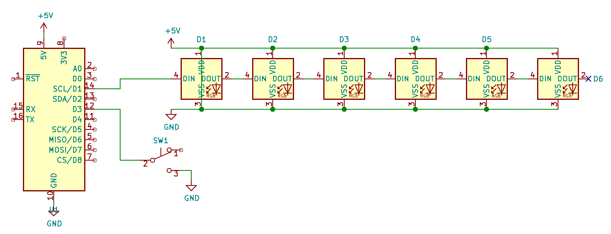

# Buzzer for the blind test

## Bill of materials
- a Wemos Mini D1 (or any ESP8266 board)
- a strip of 6 WS2812b RGB leds (a.k.a. Adafruit NeoPixels)
- an arcade push button
- a small bowerbank to power the system
- a plastic cup as a housing

## Schematics

## Firmware

Firmware is made with arduino and depends on the following libraries:
- Websockets - https://github.com/Links2004/arduinoWebSockets
- Adafruit NeoPixel - https://github.com/adafruit/Adafruit_NeoPixel 
- WS2812FX - https://github.com/kitesurfer1404/WS2812FX
